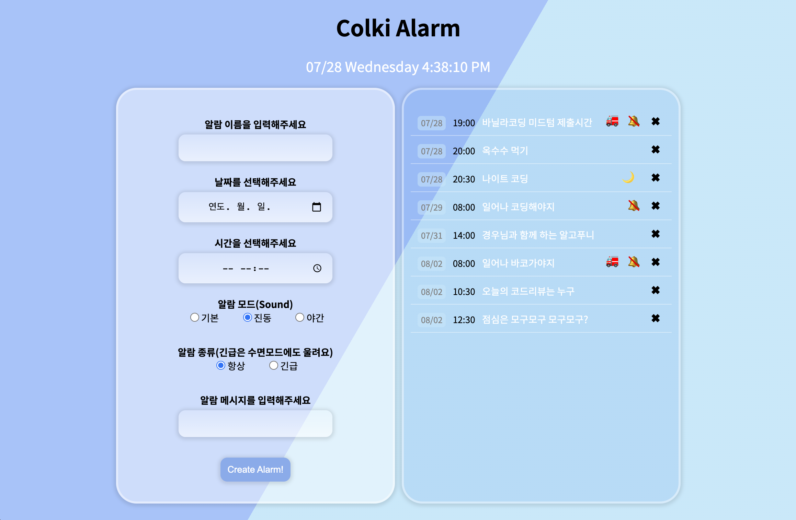
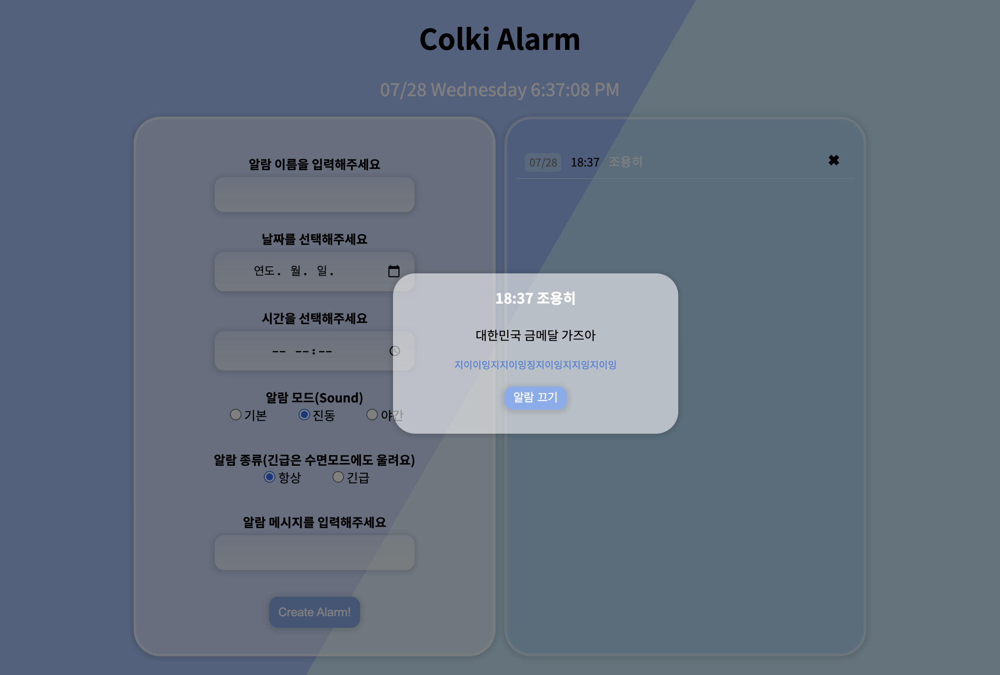
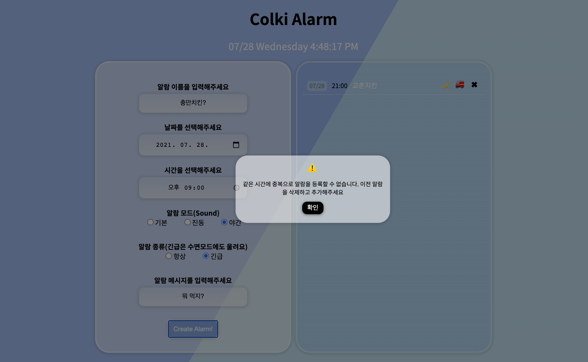

# ⏱ Colki Alarm


Colki Alarm 은 사용자가 원하는 날짜와 시간에 알람을 등록하면, 입력된 날짜와 시간에 지정된 알람이 울리는 **알람 앱**입니다.

심플한 인터페이스에 최소한의 필요한 기능만 들어 있어서 누구나 쉽게 사용할 수 있습니다.
무더위를 날릴 수 있는 시원 상큼한 UI로 사용자에게 시각적으로도 만족을 선사합니다.

<br>


```
🔽 Shortcut

<section>
  <p>Features</p>
  <p>Tech</p>
  <p>Why</p>
  <p>Challenge</p>
</section>
<footer>Deploy</footer>
```

<br>
<br>

## 🔍 Features
---

### ☻ 알람등록


---
알람을 등록하는 부분과 알람리스트가 분리 되어 있어서 일정을 등록할 때마다 오른쪽 UI에 리스트업이 되기 때문에 입력과 동시에 리스트를 체크할 수 있도록 사용자 편의를 고려하였습니다.

✖️ 아이콘을 누르면 삭제할 수 있고, 🔕 아이콘을 누르면 소리를 진동으로 바꿀 수 있습니다.
🔕 아이콘은 진동, 무음을 제외한 일반모드일 때만 보입니다.

<br>

사용자는 3가지의 알람 모드 중에서 선택할 수 있습니다.

>`일반` 소리 울림

>`진동` 진동 울림

>`야간` 소리 없음

<br>

또한 **중요한 알람일 때 긴급**으로 체크하면 야간 모드일지라도 진동이 아닌 소리 알람이 울립니다

<br>

>`항상` 선택한 모드에 따라서

>`긴급` 야간모드에도 소리울림

<br>

### ☻ 알람 시작
사용자가 등록한 시간과 일치하는 순간 입력되어 있던 모드와 일치하는 알람이 울리면서
같이 메모했던 알림 메시지가 나타납니다.

**`일반 소리 알림`**

<br>

**`진동 알림`**

<br>

**`긴급설정시`**

<br>

**`무음`**


---


<br>

### ☻ 중복 등록 방지


동일한 날짜와 시간에는 알람을 추가 등록할 수 없습니다. 만약 사용자가 동일하게 입력하는 경우 추가가 안되는 이유와 해결방법이 메시지로 나타납니다.

<br>

### ☻ 정보 미입력 방지


모든 정보는 필수로 사용자가 선택하지 않을 시 모달창에 등록이 안되는 이유와 해결방법이 메시지로 나타납니다.

<br>


## ⚒ Tech
---

+ React

+ React Redux (Redux-toolkit)

+ Styled-Component

+ Moment.js

+ UseSound


<br>

## 💡 Why
---

<br>

`Why React`


프레임워크 같은 프레임워크 아닌 리액트를 다루면서 리액트로는 할 수 있는게 정말 무궁무진하겠구나 라는 생각이 들었습니다. 동적이고 복잡한 웹페이지에서 사용자와의 인터렉션이 끝없이 몰아치는 현재 같은 시대에 제가 알기에는 리액트 이상의 라이브러리는 없습니다.

고정적인 MVC 패턴에서 벗어나서, 리액트에서는 컴포넌트 기반으로 분리가 되기 때문에 더 능률적으로 상태와 로직을 통제하기 좋았습니다. 다른 라이브러리를 함께 쓸 때도 제약이 적었고, 각 이슈마다 커뮤니티가 활성화 되어 있어 질문에 대한 답도 나름 쉽게 얻을 수 있었던 것 같습니다.

아직 사용해보지 못한 라이브러리등과 함께 리액트를 더 멋지게 조작하고 싶습니다.

`Why Redux Toolkit`

리액트 리덕스를 처음 접했던 첫 주에는 머릿속에 정리되지 않는 개념과 매분 매초 싸우고,
수정과 삭제로 도배되는 코드의 현장을 넋이 나간채로 보면서 겨우 이해할 수 있었던 것 같습니다.

상태를 다루는 리액트 기존의 useState 방식에서, 상태관리를 보다 쉽게 할 수 있는 리덕스에 대해 알고 나니
리덕스를 더 쉽고 효율적으로 쓰게 해준다는 redux-toolkit이 궁금했습니다.

리덕스에서는 action 과 reducer 파일등을 계속 이동하면서 수고롭게 코딩했었다면, toolkit에서는
한 페이지 내에서 액션과 상태를 다룰 수 있어 관리가 쉬웠고, 전반적으로 이전 리덕스에 대해 잘 모르고 있던 부분까지 이해가 잘되어서 리덕스에 한 발 더 다가갈 수 있는 계기가 된 것 같습니다.
또한 상태를 직접 복사하지 않아도 되어, 객체의 불변성에 대한 고민을 더는 대신에 전반적인 로직에 대해 생각할 시간이 더해졌던 것 같습니다.

`Why Moment.js`

캘린더 뷰어를 만들면서 날짜를 다루는 게 몹시 까다롭고 어렵다는 것을 알았습니다. 그래도 실무에서는 라이브러리를 많이 쓴다는 것에 위안을 받고 멘토분들이 추천해주셨던 날짜관련 라이브러리를 메모해두었습니다.
그리고 이번 Colki Alarm에 모멘트 라이브러리를 적용해봤는데 한 줄기 빛과도 같았습니다.

지금까지 단 한 번도 개별적으로 라이브러리를 사용해보지 않은 저에게는 이것 역시 하나의 큰 도전이었으나,
막상 사용해보니 어렵지 않고 굉장히 실용적이라고 느꼈습니다. 더러워질 수 있는 로직을 간결하게 해줘서 가독성도 좋아지고 변수를 입맛에 다룰 수 있어서, 만드는 내내 흐름읊 파악하고 상태와 변수를 조작하기에 용이했습니다.

<br>

## 💣 Challenge
---

이번 알람을 만들면서는 가장 중요하게 여긴 부분이 처음부터 코드 한 줄 한 줄 확실하게, 깔끔하게 정리하면서 작성하자 였습니다.
이전에는 일단 구현이 먼저야 하면서 결과에 집중했었는데, 나중에서야 한번 엇나간 스타일을 바로 잡고 삐걱대는 구조를 재배치하는 일이 거의 불가능하다는 걸 알았습니다.

그래서 이번에는 시작부터 꼼꼼하게 하자 하고, 중간중간 되감기하면서 구조를 다시 잡아갔습니다. 많이 배우는 시간이이어서 좋았지만 잘된 코드일지 잘 모르겠습니다!

`firebase` 를 이용해서 데이터베이스에 저장하고 불러오는 기능을 구현하고 싶었지만 리덕스로 모두 구현한 뒤에 연동하려고 하니, 시간적으로나 기술적으로 부족하여서 완성하지 못했습니다.
이 부분은 꼭 추가하고 싶습니다. 공식문서를 보는 연습도 필요할 것 같습니다.

`error` 처리를 거의 하지 못했고, 또 초기화가 안되는 부분이 있어 버그가 발생하는 부분이 있습니다. 에러처리에 대해서 많이 찾아보도록 하겠습니다.

`Test Case` 이번에 가장 큰 목표이기도 했던 테스트 케이스를 또 시작하지 못했습니다. 다음 과제때가 아니라 오늘 제출하고 나서 바로 공부하려고 합니다.

`sound` 파일을 넣어뒀는데 현재 작동하는건 버튼을 클릭할 때 뿐입니다. 에러에 대해 많이 찾아봤으나 아직 구현하지 못해서 마음으로 들을 수 있는 소리만 담았습니다.

## 👉 Deploy
---

배포주소 : [Colki Alarm](https://romantic-lamarr-9a5d19.netlify.app/)
